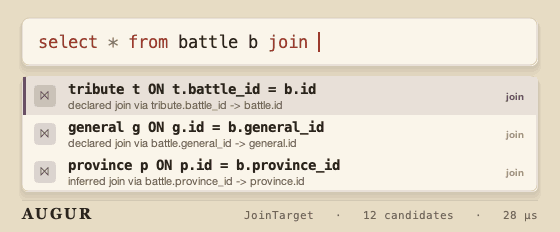
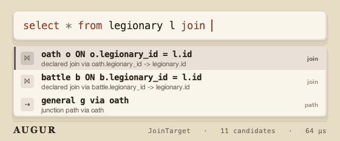
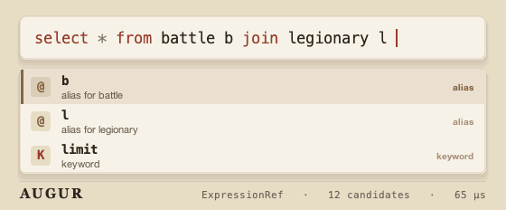
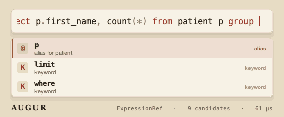
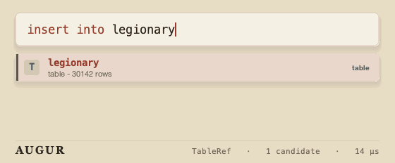
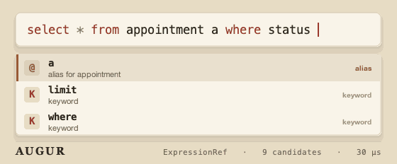

<div align="center">

<picture>
  <source media="(prefers-color-scheme: dark)" srcset="docs/media/logo-dark.svg">
  
</picture>

**Deterministic, schema-aware SQL completion for JVM hosts.**

[](https://github.com/wesleym/augur-sql/actions/workflows/ci.yml)
[](LICENSE)
[](build.gradle)
[](#design-constraints)

</div>

Augur is a pure Java library. Your host owns the editor, popup, database I/O, and
schema loading. Augur owns the hard part: understanding the SQL under the caret
and returning ranked completion candidates for a `(text, caret)` pair — with no
network, no threads, and no dependencies.

```java
Augur augur = Augur.create(catalog, Dialects.POSTGRES);
Completion c = augur.complete("select * from app", 17);
c.first().orElseThrow().insertText(); // "appointment"
```

---

## See it complete

Each clip is real engine output — a short trigger becomes a correct, schema-derived
statement. What makes a completion impressive isn't the menu; it's the **operation** it
performs for you. Every `complete()` call runs in microseconds (watch the status bar).

<table>
<tr>
<td width="50%" align="center" valign="top">
<br>
<b>Foreign-key join</b><br><sub>join target + ON predicate, straight from the FK</sub>
</td>
<td width="50%" align="center" valign="top">
<br>
<b>Two-hop join path</b><br><sub>bridged through the junction table</sub>
</td>
</tr>
<tr>
<td width="50%" align="center" valign="top">
<br>
<b>Join predicate</b><br><sub>ON clause recovered from the foreign key</sub>
</td>
<td width="50%" align="center" valign="top">
<br>
<b>GROUP BY backfill</b><br><sub>the non-aggregated select columns</sub>
</td>
</tr>
<tr>
<td width="50%" align="center" valign="top">
<br>
<b>INSERT scaffold</b><br><sub>columns paired with value placeholders</sub>
</td>
<td width="50%" align="center" valign="top">
<br>
<b>Value completion</b><br><sub>literals ranked by the column's value profile</sub>
</td>
</tr>
</table>

Every candidate carries structured data — kind, detail, documentation, and the exact
edit to apply — so your host decides how to render and insert it. The clips are
regenerated from the engine itself with `./gradlew renderGifs`.

## Try it in 30 seconds

```bash
./gradlew runSwingDemo     # desktop editor: live popup, highlighting, docs, schema explorer
./gradlew runDemoConsole   # interactive terminal REPL
./gradlew runQuickstart    # narrated tour of every completion family
```

All three run against a shared demo catalog — a small clinic schema with foreign
keys, a junction table, a view, column roles, row counts, and value profiles —
and use `|` to mark the caret, e.g. `select * from appointment a join pat|`.

> **In the Swing demo:** completion pops up as you type. `Tab` accepts. `↑ ↓`
> navigate; `Enter` accepts *after* you navigate, and otherwise just inserts a
> newline, so multi-line SQL types normally. `Ctrl+Space` forces the popup and
> `Esc` dismisses it.

## Quickstart

```java
import io.github.wesleym.augur.Augur;
import io.github.wesleym.augur.Catalog;
import io.github.wesleym.augur.ColumnRole;
import io.github.wesleym.augur.Dialects;
import io.github.wesleym.augur.Provenance;

Catalog catalog = Catalog.builder()
        .table("appointment", t -> t
                .column("id", "integer", c -> c.primaryKey())
                .column("patient_id", "integer",
                        c -> c.referencing("patient", "id", Provenance.DECLARED))
                .column("status", "varchar")
                .rowCount(48_210))
        .table("patient", t -> t
                .column("id", "integer", c -> c.primaryKey())
                .column("first_name", "varchar")
                .column("email", "varchar", c -> c.role(ColumnRole.SENSITIVE)))
        .build();

Augur augur = Augur.create(catalog, Dialects.POSTGRES);

var completion = augur.complete("select * from app");
// completion.first().orElseThrow().insertText() == "appointment"

var join = augur.complete("select * from appointment a join pat", 36);
// join.first().orElseThrow().insertText() == "patient p ON p.id = a.patient_id"

var insert = augur.complete("insert into patient ", 20);
// insert.first().orElseThrow().insertText() == "(id, first_name, email) values (?, ?, ?)"
```

## Host integration

The boundary is small: read `(text, caret)`, call `complete`, render candidates,
apply the selected edit. UI and persistence stay on your side.

```java
Completion completion = augur.complete(editorText, caretOffset);
Candidate selected = completion.first().orElseThrow();
String nextText = completion.apply(editorText, selected);
int nextCaret = completion.edit(selected).absoluteCaret();
```

See [docs/host-integration.md](docs/host-integration.md) and the dependency-free
`ReferenceAdapter` sample for a copyable adapter shape.

## What Augur completes

<details>
<summary><b>Completion families</b> (click to expand)</summary>

- **Tables & views** in table-reference and join-target positions
- **Columns**, scope-aware, including alias-qualified forms like `p.`
- **Aliases** drawn from the sources visible in scope
- **Star expansion** — `*` and `p.*`
- **Explicit column lists** — `p.id, p.first_name`
- **FK-backed join targets** — `patient p ON p.id = a.patient_id`
- **Two-hop join paths** through junction tables — `provider p2 via patient_provider`
- **FK-backed ON predicates** — `p.id = a.patient_id`
- **INSERT scaffolds** — `(id, first_name) values (?, ?)`
- **GROUP BY backfill** from non-aggregated select expressions
- **Profiled values** — `'open'` after `status =`
- **Keywords** at statement heads and clause follows

Candidates are generated, then filtered and ordered by the matcher and ranker.
Quiet contexts (inside strings and comments) suppress completion entirely.

</details>

<details>
<summary><b>Understanding layer</b> — lexer, statement splitter, caret classifier, scope resolver</summary>

```java
var tokens    = SqlLexer.lex("select * from patient", Dialects.ANSI);
var statement = StatementSplitter.statementAt("select 1; select 2", 12, Dialects.ANSI);
var context   = CaretClassifier.classify("select * from patient where |", 28, Dialects.ANSI);
var scope     = ScopeResolver.resolveStatement("select * from patient p", Dialects.ANSI);
```

Comments are dropped from token streams; strings and comments are retained as
quiet spans for completion suppression. Statement splitting happens over tokens,
so a semicolon inside a string or comment does not bleed scope across statements.
Scope resolution is likewise token-based: it recovers useful source bindings from
incomplete SQL and caps recursive child scopes.

</details>

<details>
<summary><b>Feel layer</b> — hump matcher, ranker, insertion planner</summary>

```java
var match  = HumpMatcher.match("pi", "patient_id");
var ranked = Ranker.rank(candidates, "pat", new Context.TableRef("pat"), Usage.none());
var span   = InsertionPlanner.replacementSpan("select * from app", 17, Dialects.ANSI);
```

The matcher returns tier, score, and highlight positions. The ranker returns
printable lexicographic rank keys for golden-order tests. The insertion planner
owns replacement spans, keyword-case mirroring, and dialect-aware identifier
quoting.

</details>

<details>
<summary><b>Dialect layer</b> — behavior lives in specs, not engine forks</summary>

Built-ins: `Dialects.ANSI`, `POSTGRES`, `MYSQL`, `SQLSERVER`, `SQLANYWHERE`,
`SQLITE`, `H2`, and `GENERIC`. Author your own:

```java
Dialect custom = Dialect.builder("CustomDB")
        .lex(LexProfile.ansi().withIdentifierQuote('`', '`'))
        .keywords(KeywordSet.ansi().with("UPSERT"))
        .identifierCase(IdentifierCase.LOWER)
        .pagination(Pagination.limitOffset())
        .types(TypeMap.ansi().with(".*\\bjson_document\\b.*", TypeFamily.TEXT))
        .build();
```

See [docs/dialects.md](docs/dialects.md) for the dialect-authoring guide.

</details>

<details>
<summary><b>Signals layer</b> — optional usage and value profiles</summary>

Usage and profile data are optional snapshots. Hosts implement the interfaces
directly or use Augur's default containers:

```java
DecayingUsage usage = new DecayingUsage();
usage.observeStatement("select * from appointment where status = 'open'");

Profiles profiles = Profiles.builder()
        .values("appointment", "status", List.of(
                new ValueShare("open", 0.62, false),
                new ValueShare("closed", 0.31, false)))
        .distinctCount("appointment", "status", 2)
        .build();

String htmlDoc = completion.first().orElseThrow().doc().html();
```

Storage and database access stay host-owned. See [docs/signals.md](docs/signals.md)
for persistence, profile gates, and renderer details.

</details>

## Design constraints

- **Pure JDK, zero runtime dependencies.**
- **Synchronous and deterministic** — `complete()` is a pure call over immutable snapshots.
- **Editor-agnostic** — candidates carry structured data; hosts choose rendering.
- **Dialect-extensible** — dialect behavior lives in specs, not engine forks.
- **Standalone-first** — Connector Bridge integration is a later consumer milestone.

## Build

```bash
./gradlew check          # compile, test, and enforce 90% branch coverage
./gradlew runBenchmarks  # synthetic 5,000-table catalog with a p99 latency guard
```

CI runs both on every push and pull request. See
[docs/benchmarks.md](docs/benchmarks.md) for the latency guard,
[docs/architecture.md](docs/architecture.md) for the internals, and
[docs/release.md](docs/release.md) for release prep and artifact checks.

## License

[MIT](LICENSE) © 2026 Wesley Santos
</content>
</invoke>
